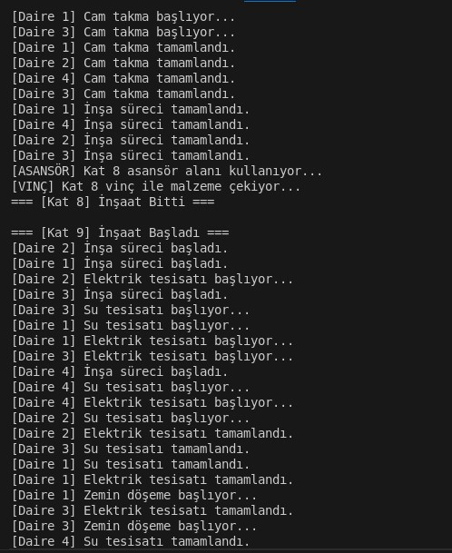
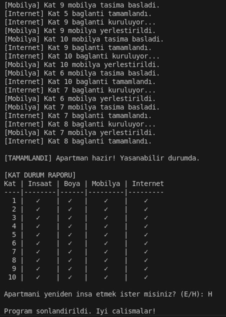

# Multi-Story Building Construction Simulation in C

This project simulates the construction process of a multi-story apartment building using C programming, focusing on **process**, **thread**, and **synchronization** concepts. Each floor and apartment is constructed with realistic steps, and disaster scenarios such as **fire** and **earthquake** are also modeled with multi-threaded design.

## Project Presentation
- Youtube Link : https://www.youtube.com/watch?v=YOUTUBE_VIDEO_ID

## Project Overview

- **10 floors**, each with **4 apartments**
- Uses `fork()` for process-based parallelism
- Uses `pthread_create()` for thread-based tasks
- Includes:
  - Plumbing
  - Electrical wiring
  - Flooring
  - Door and window installation
- Post-construction:
  - Painting (mutex synchronized)
  - Furniture setup
  - Internet setup

## Disaster Modeling

- **Fire** can randomly occur and pause all threads temporarily
- **Earthquake** may cause minor, medium, or severe consequences (even terminate the system)

## Technologies & Libraries

- `pthread.h` – Thread creation and joining
- `semaphore.h` – Semaphore control for elevator and crane
- `signal.h` – Signal handling
- `sys/mman.h` – Shared memory for inter-process communication
- `unistd.h`, `sys/wait.h`, `time.h` – POSIX tools

## Key Features

- **Process synchronization** using `fork()` and `wait()`
- **Thread synchronization** with mutexes and semaphores
- **Shared memory** via `mmap()`
- **Disaster interrupt handling**
- **Dynamic and realistic construction simulation**

## How to Run

Compile with GCC:
```bash
gcc -o construction_simulator construction_simulator.c -pthread
./construction_simulator
```

## Youtube Video Link
- https://www.youtube.com/watch?v=YOUTUBE_VIDEO_ID

## Screenshots

-
-

## ‍Contributors

- Hasan Umut Kocatepe – 21360859077 
- Halil Alpak – 22360859308

> This project was submitted for the Operating Systems course in the Spring Semester 2024–2025 at Bursa Technical University.
